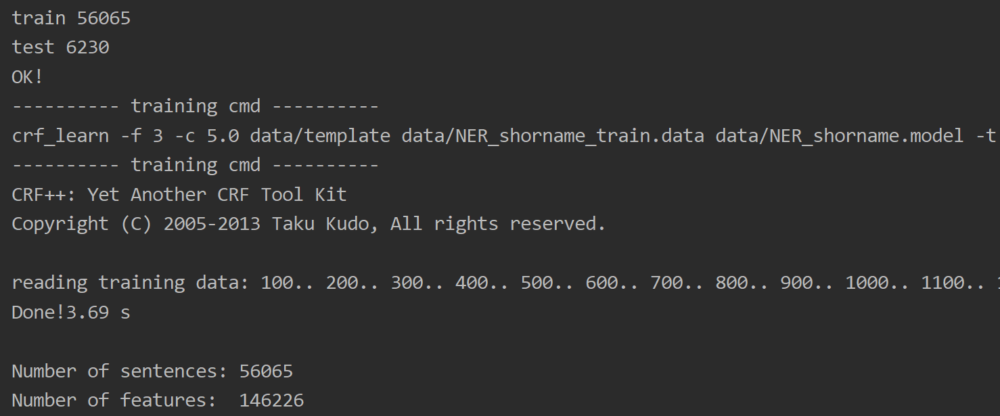
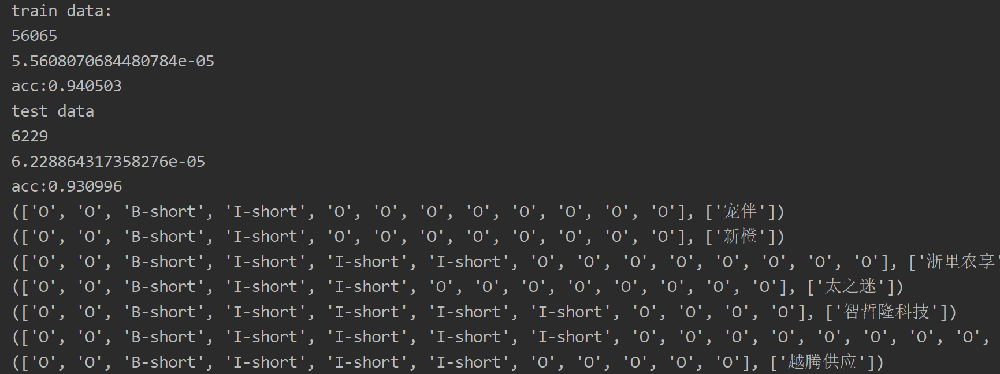

# 公司简称识别   
---  

## 安装  

pip install crfpy  

## 使用  

运行 [crf_ner.py](crf_ner.py)  

***训练***  

***预测***  

  

1. 数据预测的平均时间为0.06ms  
 
2. 训练集标签的准确率94%  

3. 测试集标签的准确率93%  

    我们看到有些公司简称抽取的结果只有两个字符，如“杭州宠伴网络技术有限公司”识别为“宠伴”，这个不一定要用算法去做，可以采取一些规则进行弥补，如匹配“网络”，“杭州”这样的后缀或者前缀，可以有效提高准确率  

